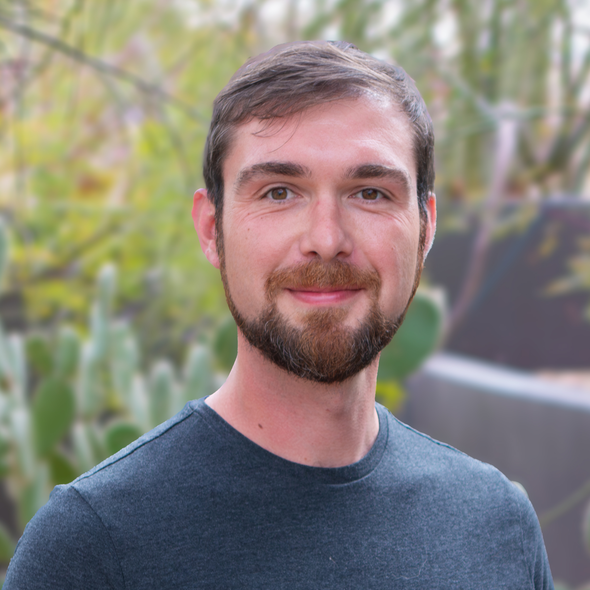

## Brian Maitner

{width=600 fig-align="center"}

*Academic stuff*

I'm an Assistant Professor of Global Change in the Integrative Biology Department at the University of South Florida - St. Petersburg. I'm a macroecologist and community ecologist who works across taxa (primarily focusing on plants and terrestrial vertebrates) using both ecological and evolutionary approaches with strong informatics and computational components. I'm a big believer in working collaboratively, which benefits from the integration of diverse perspectives and multiple skill sets. 

- Email: [bmaitner@usf.edu](mailto:bmaitner@usf.edu)
- [Bluesky](https://bsky.app/profile/maitner.bsky.social) @maitner.bsky.social
- [Twitter](https://x.com/BrianMaitner) @BrianMaitner
- [ResearchGate](https://www.researchgate.net/profile/Brian-Maitner)
- [Google Scholar](https://scholar.google.com/citations?user=GVb9deIAAAAJ&hl=en)
- [Github](https://github.com/bmaitner)

*Non-academic stuff*

Outside of work I'm an avid reader (golden age sci-fi, classic literature, philosophy, comic books, etc.) and toy fan (action figures and Legos), and I enjoy a wide variety of music and movies (particularly from the 80s).

- [Discogs](https://www.discogs.com/user/bmaitner)
- [Letterboxd](https://letterboxd.com/maitner/)

## Michiel (Mich) Pillet

{width=400 fig-align="center"}

*Academic stuff*

I'm a Postdoctoral Research Scholar in the Department of Integrative Biology at the University of South Florida and an Associate Researcher in the Department of Ecology and Evolutionary Biology at the University of Arizona. I consider myself a conservation ecologist specializing in climate change impacts on biodiversity, with a focus on cacti and succulents. My research integrates ecological theory, evolutionary approaches, species distribution modeling, and other quantitative methods to inform conservation planning and policy. I collaborate widely with academic partners and conservation stakeholders, and believe strongly in the importance of public engagement and science communication.

- Email: [mdpillet@gmail.com](mailto:mdpillet@gmail.com)
- [Google Scholar](https://scholar.google.com/citations?user=Y7Y2MxsAAAAJ&hl=en)
- [Website](https://mdpillet.github.io/Website/) (bit outdated)
- [CV](https://mdpillet.github.io/Website/cv.pdf)
- [GitHub](https://github.com/mdpillet)

*Non-academic stuff*

I'm obsessed with cacti, objectively the best plant family. I also operate a conservation nursery, [Prickly Prospects](https://pricklyprospects.com/).

## Mac Grosscup

{width=400 fig-align="center"}

*Academic stuff*

I am a Master’s Student in the Conservation Biology program at the University of South Florida – St. Petersburg. Plant ecology is one of my primary scientific interests, specifically in the Neotropics. I am curious about how plants broadly respond to global change, as well as how rare or underrepresented taxa reappear after disturbance events. I am particularly interested in examining these phenomena through the lens of trait evolution.

- Email: [jgrosscup@usf.edu](mailto:jgrosscup@usf.edu)

*Outside of the Lab*

I have an extensive collection of tropical epiphytes from families like Araceae, Orchidaceae, and Apocynaceae. I also love cooking recipes from many different global cuisines! 
